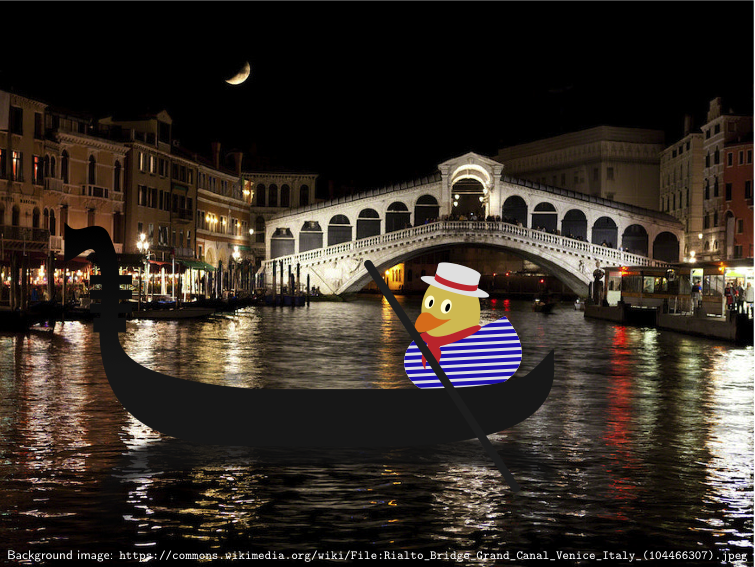
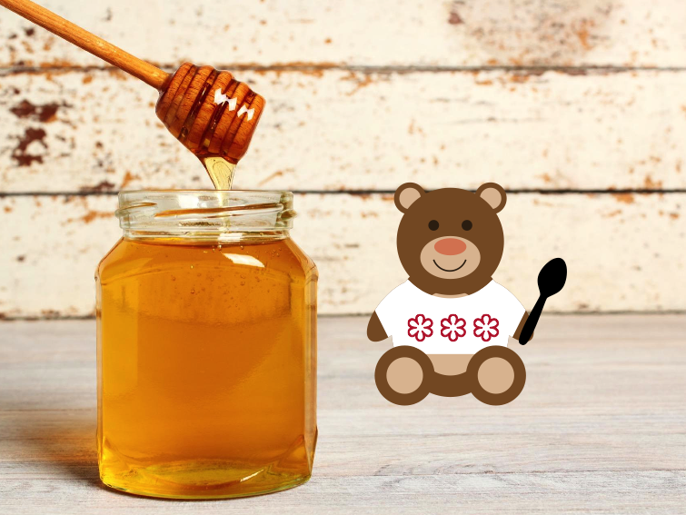
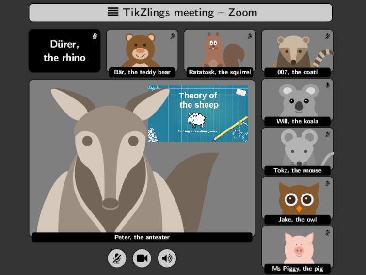
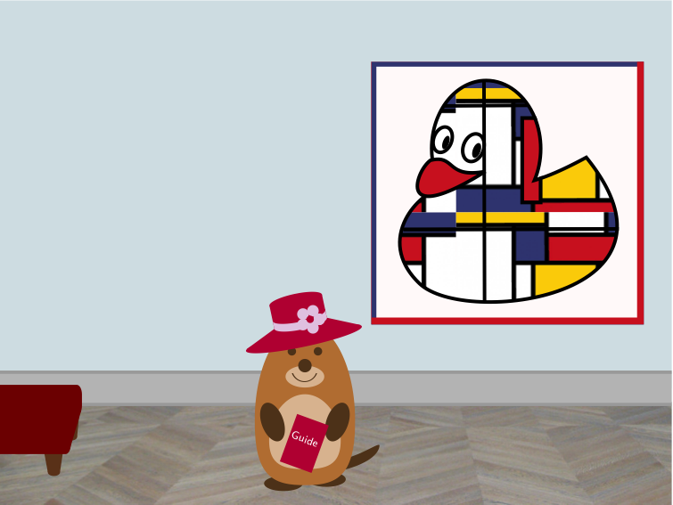

# Extravanganza 2020

# Done

## A night in venice

- Topic: TikZlings in a Gondola 

- Music: Les Contes d'Hoffmann: Barcarole 1:04 - 1:32 https://www.youtube.com/watch?v=KEiZ-J97O5A

- Source code: [./samcarter/venice/](https://github.com/samcarter/Extravaganza2020/tree/master/samcarter/venice)

## Bär necessity 

- Topic: honey pot + jumping Bär with spoon

- Music: Abba Honey, honey 0:08 - 0:20 https://youtu.be/V0hCIjKV_Qg 

- Source code: [./ulrike/honey/](https://github.com/samcarter/Extravaganza2020/tree/master/ulrike/honey)

## Zoom Meeting

- Topic: TikZlings in a Zoom meeting window, with the anteater bloke presenting the _theory of the sheep_

- Music: https://www.youtube.com/watch?v=_m47nceKkx4 (previous soundtrack was removed by YT)

- Source code: [./paulo/zoom-meeting/](https://github.com/samcarter/Extravaganza2020/tree/master/paulo/zoom-meeting)

## TikZArt

- Topic: TikZling visits a museum

- Music: https://www.youtube.com/watch?v=uJ2e7jSutrA (better suggestions are welcome - I'm really not the music expert....)

- Source code: [./samcarter/art/](https://github.com/samcarter/Extravaganza2020/tree/master/samcarter/art)

# Work in Progress

# More Ideas

Some ideas for future scenes (just to make sure I don't forget them again...)

- Sur le pont d'Avignon -> animate image from the Tikzlings Tour de France

- Museum visit episode 3: 
  - Diego Velázquez: Las Meninas 
  - Leonardo: Annunciation
  - Claude Lorrain: Landscape with St Paula of Rome Embarking at Ostia
  
- Travel of Napoleon Coati (Pyramides etc) with ABBA "Waterloo"

- Vampire ducks in "Tanz der Vampire"

- Tikzlings conquering space, maybe the Moon or Mars

- Something with the chess ducks? Which musik?

- Marmot skiing on a marmote ski piste ...

- tikz bees with honey pot, https://chat.stackoverflow.com/transcript/message/48206670#48206670
  Music: honey, honey from abba. https://www.youtube.com/watch?v=7j6OI9TxqzI
 
- Wilhelm Tell or Robin Hood: https://chat.stackoverflow.com/transcript/message/48274008#48274008

- Matrix https://chat.stackoverflow.com/transcript/message/48272890#48272890
 
- Fashion show with the newest bearwear collection

## Ideas Ulrike

### Hug the world 

Ducks hugging all sort things/beings

Music: https://www.youtube.com/watch?v=IUOVqNY64To

## Ideas Gert Fischer

(see also scan for setup)

### Christmas outing

Marmots with bobble hats, one large, 6 smaller

Music: https://youtu.be/12gsCREkIn0  Tannenbaum 0:55 - 1:15

Example background:
https://get.pxhere.com/photo/tree-branch-snow-winter-autumn-weather-fir-christmas-tree-season-christmas-decoration-2012-spruce-october-freezing-coldsnap-woody-plant-allgau-1142483.jpg?__cf_chl_jschl_tk__=8c21003a99745441177842ee810b198759dbf238-1604862036-0-AZnQLJOQsOaNlp1UdpMkLMsblUTm0XRlZpIZeH0s0dq7u4ZTtXSAVBhzWvfJQzSh0wS8_wUuwv2WmnLedAUx6oXOSNZCyOpSZueR0XDaN67EQaCrZrVrtGbSD1V_iR5of0MNdcmyASk-QMI9IocDv_d7ml2eqNp3iw9vHFk6E9MNxOZAg2X_bVTuqtJSUw8m5DlkE3RWaJp3dK6qZ141T9J8OCofU_wp9K1-tIl2T7JMdq351JLNY27749BbdO4kWRu21AeRSYFQVpb-0h0B7qCfXicdgyf7ZciYQ9Yt8PyFhyNB1X0-gHsHnlChjMqsCshHpc8AoADurBkgU6V_e47Q0lZnk96nJTjlZj1_qwRzYIPCURK_SS0q4s2PYC9kEIuW7iOokI8EyAG5q_orJKk2GbI8RsGZ1U31LLz9hzrj4mL8jaAIVU9uGa0AKA74HqUuFCqUri0diUGbIBjcsMaWuCylelSGHXPS-yalvpQD

### Amazing ducks

ducks with bagpipes in loch ness landscape

Music: amazing grace https://youtu.be/M8AeV8Jbx6M 0:58-1:23

Example background https://www.historic-uk.com/wp-content/uploads/2017/04/loch-ness-monster.jpg

### Down under

Koala with hat & guitar before an eukalyptus tree

Music: Slim Dusty - Waltzing Matilda https://youtu.be/FqtttbbYfSM 1:04 - 1:20

example background https://c1.staticflickr.com/5/4086/5070905455_fb01ef858b_b.jpg

### Tribute to ken hensley 

Snowmann left, rhino advancing along the route

Music Uriah Heep Lady in black https://youtu.be/N0H48bpJziQ 0.00-0:27

Background https://i.insider.com/5a20871af914c354018b7289?width=2400

### Two bees 

Dark stage, large bee in spotlight in the middle. A second bee
appearing and disappearing in the background. 
Copyright: thanks to C Marmot

Hamlet monologue: https://youtu.be/Rzf3ArC0afc 0:00 - 0:23

### Tribute to Sir Sean Connery (1930-2020)

Bond ducks (with bow ties), and mouse with microphone singing. Foto in
the background

Music: nobody does it better https://youtu.be/7__rt0hRm8s 1:20-1:33

### Grand Finale

tikzlings with masks, UN-flags or flags from various countries

Music we shall overcome https://www.youtube.com/watch?v=Aor6-DkzBJ0 0:56- 1:17

