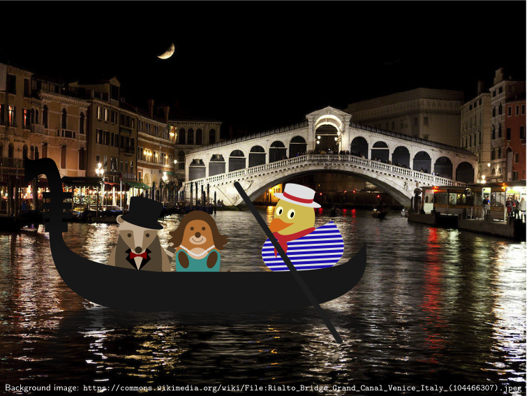

# The Great TikZlings Christmas Extravaganza 2020

This repository contains the souce code of the Great TikZlings Extravanganza 2020, created by [Ulrike](https://github.com/u-fischer) & [Gert Fischer](https://github.com/g-fischer), [Paulo Cereda](https://github.com/cereda), [Plergux](https://github.com/Plergux) and [samcarter](https://github.com/samcarter).

The full video is available from https://vimeo.com/492532561

## Christmas outing

- Topic: TikZlings with bobble hats, one large, 6 smaller

- Music: https://youtu.be/12gsCREkIn0  Tannenbaum 0:55 - 1:15

- Source Code: [./ulrike/bobble/](https://github.com/TikZlings/Extravaganza2020/tree/main/ulrike/bobble)

## Sean Connery 

- Topic: Mouse singing, James Bond ducks before Sean Connery picture

- Music: nobody does it better https://youtu.be/7__rt0hRm8s 1:20-1:33

- Source Code [./ulrike/seanconnery/](https://github.com/TikZlings/Extravaganza2020/tree/main/ulrike/seanconnery)

## Bär necessity 

- Topic: honey pot + jumping Bär with spoon

- Music: Abba Honey, honey 0:08 - 0:20 https://youtu.be/V0hCIjKV_Qg 

- Source code: [./ulrike/honey/](https://github.com/TikZlings/Extravaganza2020/tree/main/ulrike/honey)

## Baaaaa

- Topic: Sheep sounds in many different languages

- "Music": https://www.youtube.com/watch?v=D5bjo4rMOAU

- Source Code: [./samcarter/baaaaa/](https://github.com/TikZlings/Extravaganza2020/tree/main/samcarter/baaaaa)

## Amazing ducks

- Topic: ducks with bagpipes in loch ness landscape

- Music: amazing grace https://youtu.be/M8AeV8Jbx6M 0:58-1:23

- Source Code: [./samcarter/lochness/](https://github.com/TikZlings/Extravaganza2020/tree/main/samcarter/lochness)

## A night in venice

- Topic: TikZlings in a Gondola 

- Music: Les Contes d'Hoffmann: Barcarole 1:04 - 1:32 https://www.youtube.com/watch?v=KEiZ-J97O5A

- Source code: [./samcarter/venice/](https://github.com/TikZlings/Extravaganza2020/tree/main/samcarter/venice)

## Hug the world 

- Topic: Ducks hugging all sort things/beings

- Music: https://www.youtube.com/watch?v=IUOVqNY64To

- Source Code: [./paulo/hug-the-world/](https://github.com/TikZlings/Extravaganza2020/tree/main/paulo/hug-the-world)

## TikZArt

- Topic: TikZling visits a museum

- Music: https://www.youtube.com/watch?v=uJ2e7jSutrA (better suggestions are welcome - I'm really not the music expert....)

- Source code: [./samcarter/art/](https://github.com/TikZlings/Extravaganza2020/tree/main/samcarter/art)

## Two bees 

- Topic: Dark stage, large bee in spotlight in the middle. A second bee appearing and disappearing in the background. 

- Music: Hamlet monologue: https://youtu.be/Rzf3ArC0afc 0:00 - 0:23

- Source Code: [./samcarter/bees/](https://github.com/TikZlings/Extravaganza2020/tree/main/samcarter/bess)

## Down under

- Koala with hat & guitar before an eukalyptus tree

- Music: Slim Dusty - Waltzing Matilda https://youtu.be/FqtttbbYfSM 1:04 - 1:20

- Source Code: [./ulrike/downunder](https://github.com/TikZlings/Extravaganza2020/tree/main/ulrike/downunder)

## Zoom Meeting

- Topic: TikZlings in a Zoom meeting window, with the anteater bloke presenting the _theory of the sheep_

- Music: https://www.youtube.com/watch?v=_m47nceKkx4 (previous soundtrack was removed by YT)

- Source code: [./paulo/zoom-meeting/](https://github.com/TikZlings/Extravaganza2020/tree/main/paulo/zoom-meeting)

## 007

- Topic: 007

- Music: golden gun https://youtu.be/lEfwQ-S3sdk 0:23-037

- Source code: [./plergux/007/](https://github.com/TikZlings/Extravaganza2020/tree/main/plergux/007)

## xcoffins

- Topic: Dancing duck pallbearers

- Music: Astronomia https://www.youtube.com/watch?v=iLBBRuVDOo4

- Source Code: [./paulo/xcoffins/](https://github.com/TikZlings/Extravaganza2020/tree/main/paulo/xcoffins)

## Queen of the Night

- tikzling in a moon crescent under stars singing the aria of queen of the night from the Zauberflöte

- Music: The Magic Flute – Queen of the Night https://youtu.be/xpI4uxcfY-4 0.57 - 1.15"

- Source Code: [./ulrike/queen](https://github.com/TikZlings/Extravaganza2020/tree/main/ulrike/queen)

## Dance of the Vampires

- Topic: vampires

- Music: https://www.youtube.com/watch?v=qrVTNmimDp0

- Source Code: [./samcarter/vampires/](https://github.com/TikZlings/Extravaganza2020/tree/main/samcarter/vampires)

## Grand Finale

- Topic: tikzlings with masks, UN-flags or flags from various countries

- Music: we shall overcome https://www.youtube.com/watch?v=Aor6-DkzBJ0 0:56- 1:17

- Source Code: [./ulrike/finale/](https://github.com/TikZlings/Extravaganza2020/tree/main/ulrike/finale)

